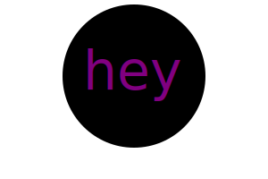

# SVG Logo Maker

## License

   

***MIT License***

## Table of Contents

- [Description](#description)
- [Usage](#usage)
- [Example](#example)
- [Credits](#credits)
- [License](#license)
- [Contribute](#contribute)
- [Questions](#questions)

## Description

This application allows the user to generate a simple logo for their projects in the form of an SVG file without having to seek out a graphic designer to do so.  The logo generated is 300x200 pixel image.  Both inquirer and jest packages where used to run and test this project.

## Installation
 - [Visual Studio Code](https://code.visualstudio.com/)
 - [node.js](https://nodejs.org/en)
 - [jest](https://www.npmjs.com/package/jest)
 - [inquirer](https://www.npmjs.com/package/inquirer/v/8.2.4) : Version 8.2.4

   *(Note)* - Information on fs, or filesystem, included with node.js can be found [here](https://nodejs.org/api/fs.html)

## Usage

Once your installations are complete, run "node index.js" from the command line, make sure you are in the directory you want to run the file from. Answer the prompts by entering up to 3 characters, a text color, a shape, and a shape color (both colors can be a color keyword or hexidecimal number). Your new SVG logo will be generated under the file name 'logo.svg'. 
- To view logo, either copy path and paste into browser or download an SVG viewer extension in Visual Studio Code.

## Example

### Video Walkthrough
  - [Click here](https://drive.google.com/file/d/1lrfKIRGqv8fIGT6PVCYPYWoIsWs2d8IW/view)

## Credits

 1. This application is an assignment from module 10 from [The Ohio State University Coding Boot Camp](https://eng-bootcamps.osu.edu/)
 2. The transform function to position the shapes better was made with help from Bing AI.

## Contribute 

If you would like to contribute please use the [Contributor Covenant](https://www.contributor-covenant.org/).

### Future Development
  - Add more choices of shapes and more logic to shape.js

## Questions

 - Github Profile for [rickibobbii](https://github.com/rickibobbii)
